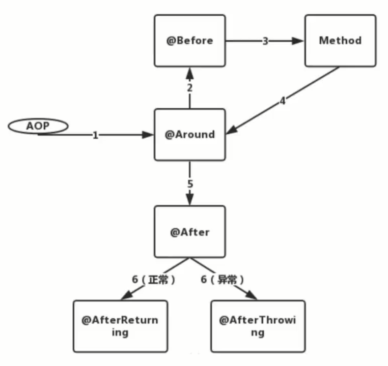
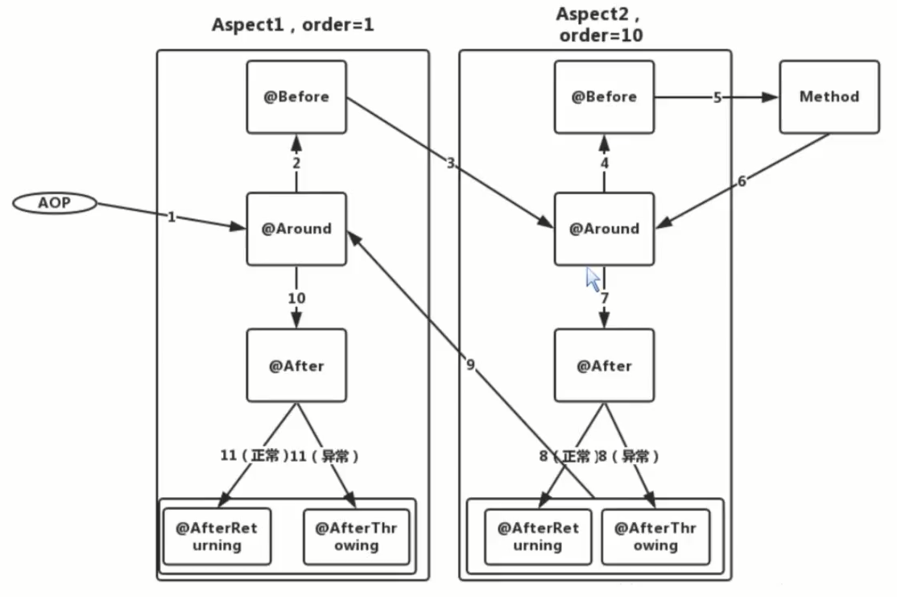


## AOP 的子民们

- Aspect 切面：将横切关注点逻辑进行模块化封装的实体对象
- Advice 通知：好比是 Class 里面的方法，还定义了织入逻辑的时机
- JoinPoint 连接点：允许使用 Advice 的地方（SpringAOP 默认只支持方法级别的 JoinPoint）
- Pointcut 切入点：定义一系列规则对 JoinPoint 进行筛选
- Target 目标对象：符合 Pointcut 条件，要被织入横切逻辑的对象

## Advice 的种类

- BeforeAdvice：在 JoinPoint 前被执行的 Advice
- AfterAdvice：好比 try...catch...finally 里面的 finally
- AfterReturningAdvice：在 JoinPoint 执行流程正常返回后被执行
- AfterThrowingAdvice：JoinPoint 执行过程中抛出异常才会触发
- AroundAdvice：在 JoinPoint 前和后都执行，最常用的 Advice

## 单个 Aspect 的执行顺序

## 多个 Aspect 的执行顺序

## Introduction —— 引入型 Advice

- 为目标类引入新接口，而不需要目标类做任何实现
- 使得目标类在使用的过程中转型成新接口对象，调用新接口的方法

## AOP 是 OOP 里的 “寄生虫”

AOP 需要 OOP 理解自己的语义，所以并不像单独使用这么灵活

- 织入：将 Aspect 模块化的横切关注点集成到 OOP 里
- 织入器：完成织入过程的执行者，如 ajc
- Spring AOP 则会使用一组类来作为织入器以完成最终的织入操作

## SpringAOP 的实现原理之 JDK 动态代理

- 程序运行时动态生成类的字节码，并加载到 JVM 中
- 要求【被代理的类】必须实现接口
- 并不要求【代理对象】去实现接口，所以可以复用代理对象的逻辑

## SpringAOP 的实现原理之 CGLIB 动态代理

代码生成库：Code Generation Library

- 不要求被代理类实现接口
- 内部主要封装了 ASM Java 字节码操控框架
- 动态生成子类以覆盖非 final 的方法，绑定钩子回调自定义拦截器

## JDK 动态代理和 CGLIB

实现机制

- JDK 动态代理：基于反射机制实现，要求业务类必须实现接口
- CGLIB：基于 ASM 机制实现，生成业务类的子类作为代理类

JDK 动态代理的优势

- JDK 原生，在 JVM 里运行较为可靠
- 平滑支持 JDK 版本的升级

CGLIB 的优势

- 被代理对象无需实现接口，能实现代理类的无侵入

## Spring AOP 的底层机制

- CGLIB 和 JDK 动态代理共存
- 默认策略：Bean 实现了接口则用 JDK，否则使用 CGLIB

## 通过注解将类当做 Bean 管理起来的方式

- `@Controller` `@Service` `@Repository` `@Component` 标记的类
- `@Bean` 标记的方法
- `@Import` 标签

## Spring AOP 的总体流程

- 注册解析 AOP 的服务
- 解析和加载横切逻辑
- 将横切逻辑织入目标 Bean 中